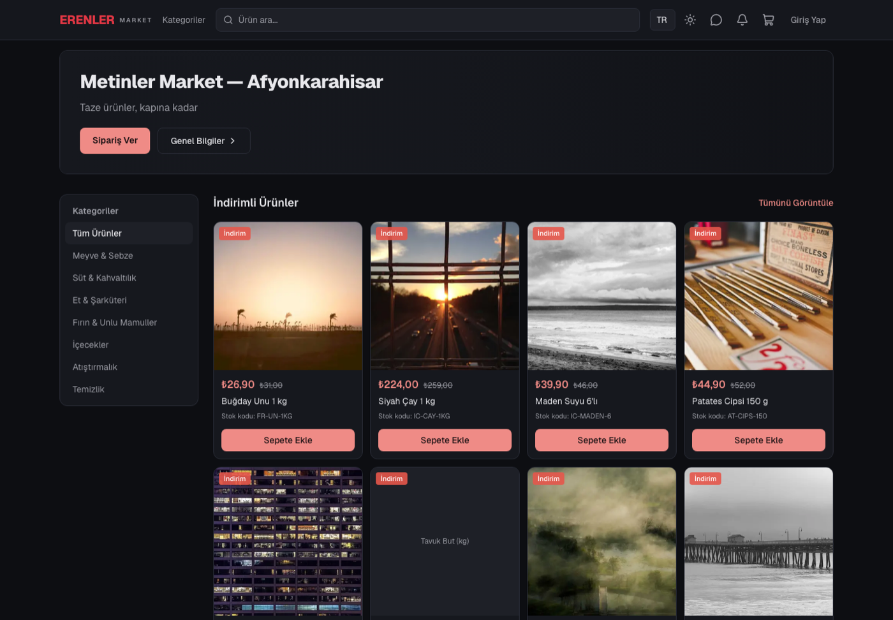
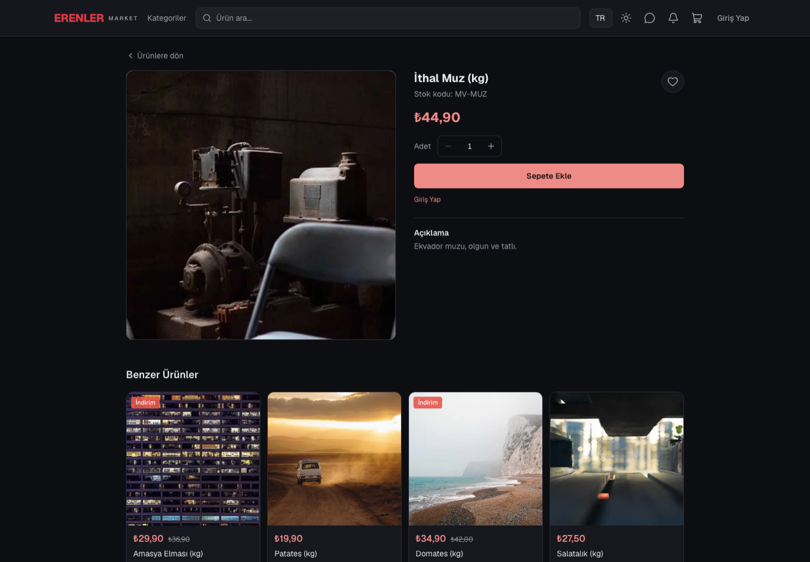
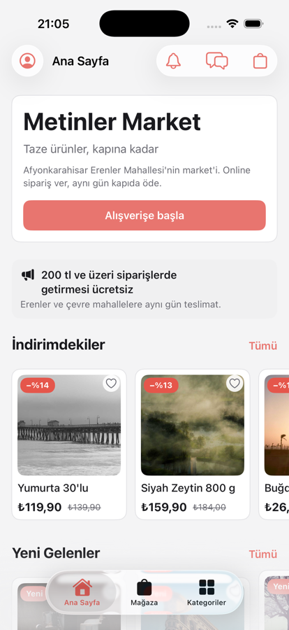
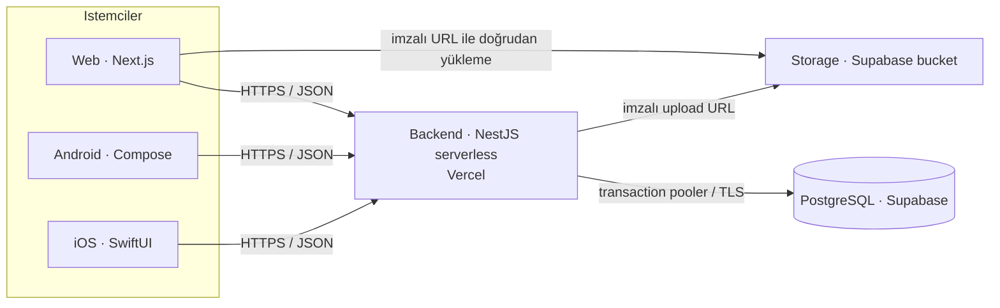

# Erenler Market

Afyonkarahisar'daki Erenler Market için online sipariş sistemi. Tek market
(single‑tenant), 6 dilli, ortak bir NestJS API'sine bağlı **web + Android + iOS**
istemcileri olan bir monorepo.

Aynı zamanda backend, web ve iki native mobil istemciyi tek bir API sözleşmesi
etrafında uçtan uca kurma pratiğini gösteren bir portföy projesidir.

> Bu sürüm Erenler Market'e özeldir; marka adı, içerik ve mağaza bilgisi
> veritabanından yönetildiği için ileride başka marketlere uyarlanabilir.

## Canlı demo

| | Adres | Not |
|---|---|---|
| **Web (storefront)** | <https://market-app-dun.vercel.app> | Kayıt olup sipariş verebilirsiniz |
| **Web (admin panel)** | `/admin` | Yalnızca admin rolündeki hesaba açık |
| **API — Swagger UI** | <https://backend-ruby-xi.vercel.app/api> | Tüm uçların canlı dokümanı |
| **Android** | `dist/ErenlerMarket-1.1-release.apk` | İmzalı APK (sideload) |
| **iOS** | — | Kaynak derlenir; TestFlight için Apple Developer üyeliği gerekir |

Prod veritabanı Supabase'de. Backend Vercel'de serverless çalışır (soğuk başlangıçta
ilk istek birkaç saniye sürebilir).

## Ekran görüntüleri

| Web storefront | Ürün sayfası |
|---|---|
|  |  |

| iOS (SwiftUI) | Android (Compose) — aynı ekranlar |
|---|---|
|  |  |

## Monorepo

| Klasör | Sorumluluk | Stack |
|---|---|---|
| [`backend/`](backend/) | REST API | NestJS 11 + Prisma (driver adapter) + PostgreSQL |
| [`database/`](database/) | Ham SQL migration + seed | PostgreSQL / Supabase |
| [`web/`](web/) | Müşteri arayüzü + `/admin` paneli | Next.js 16 (App Router) + TypeScript + Tailwind v4 + next-intl |
| [`mobile-android/`](mobile-android/) | Android uygulaması | Kotlin + Jetpack Compose + Hilt + Room |
| [`mobile-ios/`](mobile-ios/) | iOS uygulaması | Swift + SwiftUI + `@Observable` + SwiftData (Tuist) |
| [`docs/`](docs/) | Mimari, ER diyagramı, OpenAPI sözleşmesi | — |

## Mimari özet

Tüm istemciler backend'e HTTP/JSON ile bağlanır ve tek bir API sözleşmesine
([`docs/api-spec.yaml`](docs/api-spec.yaml), Swagger'dan üretilir) göre yazılır.



**Öne çıkan kararlar** (gerekçeleriyle: [docs/architecture.md](docs/architecture.md)):

- **Serverless backend** → kalıcı süreç/WebSocket yok; mesajlaşma ve bildirimler
  **polling** ile (istemciler 5–30 sn aralıkla çeker).
- **Prisma driver adapter** (`@prisma/adapter-pg`) — serverless cold‑start ve
  `dist/` çözümlemesi için klasik query‑engine yerine.
- **Çok dilli içerik** — ürün/kategori/duyuru metinleri jsonb harita olarak
  saklanır (`{"tr": "...", "en": "..."}`); TR zorunlu, diğerleri opsiyonel, eksikse
  TR'ye düşer. Storefront `?lang=` ile tek dile çözer, admin dil sekmeleriyle düzenler.
- **6 locale** (tr, en, de, fr, ar, nl) — Türkçe varsayılan; DE/FR/NL gurbetçi,
  AR Suriyeli topluluk için. Arayüz tam çevrili; RTL layout aynası yok (bilinçli),
  Arapça metin `dir="auto"` ile kendi bloğunda sağdan sola akar.
- **Auth** — 15 dk access + rotasyonlu refresh token; refresh DB'de yalnızca
  sha256 hash'i ile saklanır.
- **Mobil istemciler paralel** — Android (Kotlin/Compose, MVVM + `StateFlow`,
  Hilt) ve iOS (SwiftUI, `@Observable`, Tuist ile modüler SPM) aynı ekranları
  aynı backend'e karşı 1:1 kurar; her ikisi de dar kapsamlı yerel önbelleğe sahip
  (Room / SwiftData — son gezilenler + çevrimdışı katalog).
- **Fiyat sunucuda dondurulur** — sipariş anındaki birim fiyat `unit_price_snapshot`
  olarak kaydedilir; stok işlemleri `$transaction` içinde.

Veritabanı şeması: [docs/er-diagram.md](docs/er-diagram.md) · 20 tablo, ham SQL migration'lar.

## Özellikler

**Storefront (web + mobil):** çok dilli katalog + arama/filtre, ürün detayı,
sepet, ödeme (kapıda nakit/kart + kupon), sipariş takibi + durum zaman çizelgesi,
istek listesi, mağaza ile mesajlaşma, bildirimler, açık/koyu tema, çevrimdışı
katalog (mobil).

**Admin (web + mobil):** gösterge paneli, ürün/kategori/kupon/duyuru yönetimi
(dil sekmeleriyle), sipariş listesi + durum güncelleme, müşteri mesajlarına yanıt,
müşteri listesi, mağaza ayarları (çalışma saatleri dahil), azalan stok, yeni
sipariş/mesaj/müşteri rozetleri + toast.

## Durum

| Bileşen | Durum |
|---|---|
| `backend/` | v1 tamam — 16 modül, JWT auth, çok dilli içerik, rate limiting; Vercel'de canlı |
| `database/` | v1 tamam — 20 tablo, 3 migration; prod: Supabase |
| `web/` | v1 tamam — storefront + hesap + sepet/sipariş + mesajlaşma + admin + 6 dil + tema; Vercel'de canlı |
| `mobile-android/` | v1.1 — katalog, auth, ticaret, mesaj/bildirim, çevrimdışı, admin ekranları; imzalı APK |
| `mobile-ios/` | v1 tamam — Android ile aynı kapsam + admin ekranları |

**Bilinçli olarak ertelenenler:** online ödeme entegrasyonu, mobil push bildirimleri
(FCM/APNs — şu an yalnızca uygulama içi), backend test kapsamının genişletilmesi,
hata izleme (Sentry).

## Geliştirme

Her alt klasördeki `.env.example` dosyasını `.env` (web'de `.env.local`) olarak
kopyalayıp değerleri girin. Gerçek secret'lar asla commit edilmez.

```bash
# backend  (PostgreSQL gerekir; şema için database/migrations/*.sql)
cd backend && npm install && npm run start:dev        # :3000  ·  Swagger: /api

# web
cd web && npm install && npm run dev                  # :3001

# android
cd mobile-android && ./gradlew :app:assembleDebug

# ios  (Tuist gerekir)
cd mobile-ios && tuist generate
```

CI ([`.github/workflows/ci.yml`](.github/workflows/ci.yml)): her push'ta backend
(lint · test · build), web (lint · build), Android (test · lint · assemble).
