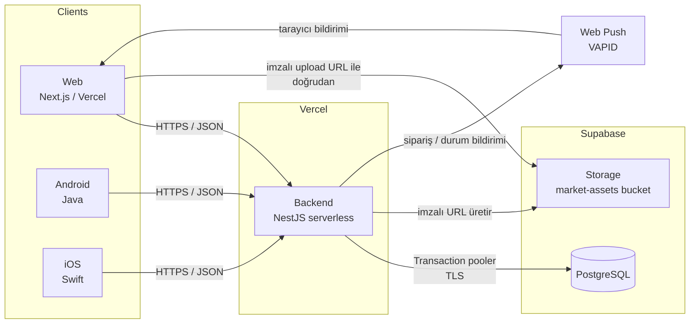

# Mimari

## Genel Bakış

MarketApp, Afyonkarahisar'daki Erenler Market için online sipariş sistemidir.
**Tek market (single-tenant)** için tasarlanmıştır — çok kiracılı bir SaaS değil.
Aynı zamanda backend, web, mobil ve veritabanı becerilerini gösteren bir portföy
projesidir; bu yüzden mimari kararlar hem üretim kalitesi hem de "neden böyle
yapıldı" anlatısı gözetilerek alınmıştır.

Monorepo, altı bileşen:

| Klasör | Sorumluluk | Stack |
|---|---|---|
| `backend/` | REST API | NestJS + Prisma + PostgreSQL |
| `database/` | Şema + migration + seed | Ham SQL migration'lar |
| `web/` | Müşteri arayüzü + `/admin` paneli | Next.js 16 (App Router) + TypeScript + Tailwind |
| `mobile-android/` | Android uygulaması | Java (henüz başlanmadı) |
| `mobile-ios/` | iOS uygulaması | Swift (henüz başlanmadı) |
| `docs/` | Mimari, ER diyagramı, OpenAPI sözleşmesi | — |

Tüm istemciler backend'e HTTP/JSON ile bağlanır. API sözleşmesi
[`docs/api-spec.yaml`](api-spec.yaml) dosyasında (Swagger'dan üretilir); üç istemci
de bu sözleşmeye göre geliştirilir.

## Sistem Topolojisi

## Bileşen Kararları

### Backend — NestJS + Prisma

- **NestJS**: modüler yapı (her domain bir modül: `auth`, `catalog`, `orders`…),
  DI, guard/interceptor katmanları, `@nestjs/swagger` ile otomatik API dokümanı.
- **Prisma + `@prisma/adapter-pg` (driver adapter)**: eski query-engine ikilisi
  yerine driver adapter kullanıldı. Sebep: serverless ortamda cold-start süresi
  ve `dist/` çözümlemesi. Client varsayılan konuma generate edilir (özel `output`
  yolu `dist/` resolüsyonunu bozuyordu — bkz. git geçmişi).
- **Serverless uyumu**: Vercel'de kalıcı süreç yok → uzun ömürlü WebSocket yok.
  Bu, mesajlaşma ve bildirimlerin **polling** ile çözülmesini gerektirdi
  (istemciler 10–30 sn aralıkla ilgili endpoint'i çeker).

### Veritabanı — PostgreSQL / Supabase

- **Tek market** → çok kiracı kolonu, tenant izolasyonu yok. Basitlik kazanımı.
- **Tüm primary key'ler UUID** (`gen_random_uuid()`): sipariş/kullanıcı ID'lerinin
  tahmin edilebilir sıralı olmasını engeller.
- **Prod**: Supabase (eu-central-1). Bağlantı **transaction pooler** (port 6543)
  üzerinden — serverless'ta IPv4 + connection pooling için. TLS zorunlu
  (`ssl: { rejectUnauthorized: false }`, Supabase kendi CA'sını kullandığı için).
- **Local**: Homebrew PostgreSQL (`marketapp` veritabanı).
- **Migration'lar ham SQL** (`database/migrations/000N_*.sql`), local + Supabase'e
  elle uygulanır; sonra `prisma db pull` + `generate` ile şema/istemci senkron
  tutulur. Prisma Migrate yerine bu yöntem, iki ortama tam kontrollü uygulama için
  seçildi.
- **Free-tier tuzağı**: Supabase projesi ~7 gün hareketsizlikte kendini
  duraklatır. `backend/vercel.json` içindeki günlük cron `/health`'i pingleyerek
  (bir `SELECT 1` çalıştırır) projeyi uyanık tutar.

Detaylı tablo listesi: [`docs/er-diagram.md`](er-diagram.md). Özet: kullanıcı &
hesap (6 tablo), mağaza bilgisi (1), katalog (3), alışveriş akışı (6), etkileşim
(4) — toplam 20 tablo.

### Web — Next.js 16

- **App Router + Server Components**: katalog/ürün/statik sayfalar sunucuda
  render edilir (SEO + ilk yük). Sepet, ödeme, admin gibi etkileşimli akışlar
  client component + **TanStack Query**.
- **Tek proje, iki alan**: `src/app/[locale]/(shop)/…` müşteri arayüzü,
  `src/app/[locale]/admin/…` ayrı layout'lu yönetim paneli. Rol koruması
  client-side (`RequireAuth` / `RequireAdmin`) — token localStorage'da olduğu
  için sunucu bilemez.
- **Kimlik saklama**: access + refresh token `localStorage`'da. `authedApi`
  sarmalayıcısı 401 (süre dolumu) veya 403 (bayat rol) durumunda bir kez refresh
  token ile yeniler.
- **next-intl v4**: 6 dil, `localePrefix: 'as-needed'` (TR öneksiz, diğerleri
  `/en`, `/de`…). Next.js 16'da `middleware` → `proxy` yeniden adlandırıldığı için
  locale yönlendirmesi `src/proxy.ts` içinde.
- **Tema**: `next-themes`, `data-theme` attribute'u; token'lar `globals.css`.

## Kimlik & Yetkilendirme

- **Access token**: JWT, 15 dk, payload `{ sub, role }`.
- **Refresh token**: rastgele 64 byte, **hash'lenmiş** olarak `refresh_tokens`
  tablosunda; her kullanımda **rotasyon** (eski iptal, yeni verilir), logout'ta
  iptal. Ham token asla saklanmaz.
- **Rol**: `users.role` (`customer` | `admin`). Admin endpoint'leri `RolesGuard` +
  `@Roles('admin')` ile korunur; guard JWT'deki role'e bakar. Rol değişince
  yeni token gerekir (çıkış/giriş ya da refresh).
- Şifre sıfırlama akışı v1 kapsamına alınmadı (e-posta sağlayıcı kararı bekliyor).

## Çok Dillilik (i18n)

İki katman:

1. **Arayüz metinleri**: `web/src/messages/{tr,en,de,fr,ar,nl}.json` — tamamen
   çevrili, next-intl ile.
2. **İçerik** (ürün adı/açıklaması, kategori adı, duyuru, mağaza sloganı):
   veritabanında **jsonb map** olarak tutulur — `{"tr": "...", "en": "..."}`.
   - `tr` anahtarı zorunlu; diğer diller opsiyonel.
   - Storefront GET'leri `?lang=xx` / `Accept-Language`'e göre tek dile çözer;
     çeviri yoksa `tr`'ye düşer.
   - Admin GET'leri `?raw=true` ile ham map'i alır (çeviri sekmeli editör için).
   - `GET /products?q=` araması jsonb'de tüm dillerde `ILIKE` ile çalışır.

**Karar**: Arapça için tam RTL layout **yapılmadı** (mağaza sahibinin tercihi).
Yalnızca içerik metin blokları `dir="auto"` ile render edilir.

## Görsel Depolama

- **Supabase Storage**, tek public bucket `market-assets` (`products/`, `avatars/`
  prefix'leri).
- Backend **imzalı upload URL** üretir (`POST /uploads/product-image` |
  `/uploads/avatar`); istemci dosyayı **doğrudan** Supabase'e PUT eder. Dosya
  serverless fonksiyondan geçmez (payload/süre limiti sorunu yok).

## Deploy & Altyapı

- **İki ayrı Vercel projesi**, tek repo: biri `backend/` (NestJS preset), biri
  `web/` (Next.js preset). `main`'e her push ikisini de otomatik deploy eder.
- **Ortam değişkenleri** Vercel dashboard'da; repoda `.env.example` şablonları.
  Kritik: `DATABASE_URL`, `JWT_SECRET`, `SUPABASE_URL`,
  `SUPABASE_SERVICE_ROLE_KEY`, `VAPID_*`, `NEXT_PUBLIC_API_BASE_URL`.
- **CORS**: backend `enableCors()` (tüm origin) — web farklı domain'den çağırır.
- **CI/otomatik test**: henüz yok (bilinen eksik).

## Önemli Kararlar Günlüğü

| Karar | Alternatif | Neden |
|---|---|---|
| Single-tenant | Çok kiracılı SaaS | Tek market; gereksiz karmaşıklık |
| UUID PK | Sıralı integer | Tahmin edilebilirlik riski |
| Prisma driver adapter | Klasik query engine | Serverless cold-start + dist/ resolüsyonu |
| Polling (mesaj/bildirim) | WebSocket / 3. parti realtime | Vercel serverless'ta kalıcı bağlantı yok |
| Ham SQL migration | Prisma Migrate | İki ortama kontrollü elle uygulama |
| jsonb i18n içerik | Ayrı çeviri tabloları | Daha az join, tek satır güncelleme |
| İmzalı upload URL | Backend'den proxy upload | Fonksiyon payload/süre limiti |
| localStorage token | httpOnly cookie | SSR'sız istemciler (mobil) için tek model; XSS riski kabul edildi |
| RxJava yok (Android planı) | RxJava | LiveData + Coroutines yeterli, daha basit |

## Bilinen Sınırlar

- Otomatik test kapsamı çok düşük.
- Şifre sıfırlama yok.
- Ödeme "kapıda nakit/kart" ile sınırlı — gerçek ödeme sağlayıcısı entegre değil.
- Web push kurulumu backend'de hazır, web istemcisinde service worker henüz yok.
- Admin dashboard sadece sayısal kart; grafik yok.
- Mobil uygulamalar başlanmadı.
